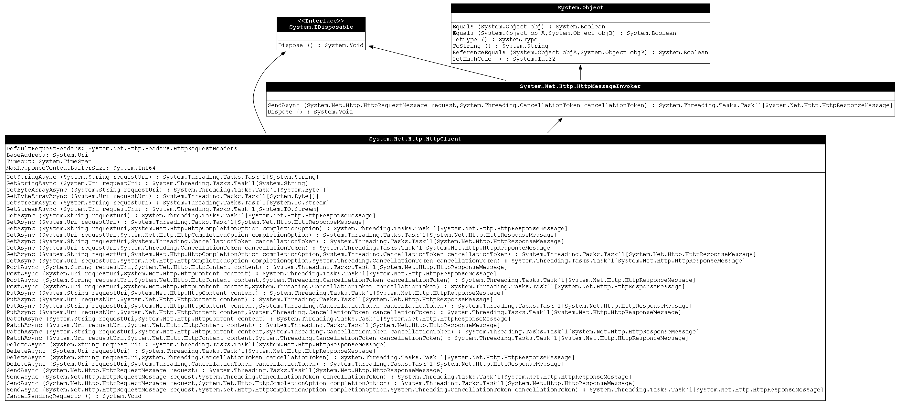

# TypeToUml

Create UML diagrams from .NET types.

## Installation

Install graphviz, this can be done with chocolatey:
```
choco install graphviz
```

Install the Module:
```powershell
Install-Module TypeToUml -Scope CurrentUser
```

## Usage

```powershell
[System.Net.Http.HttpClient] | Show-TypeUmlDiagram -IncludeBaseTypes -IncludeInterfaces
```



This also works very well with [ClassExplorer](https://github.com/SeeminglyScience/ClassExplorer)

```powershell
find-type -InheritsType System.Management.Automation.Language.Ast | Show-TypeUmlDiagram -IncludeBaseTypes
```

## Credits
Big thanks to @kevinmarquette for PSGraph, which is a dependency of this module, for making this so easy.